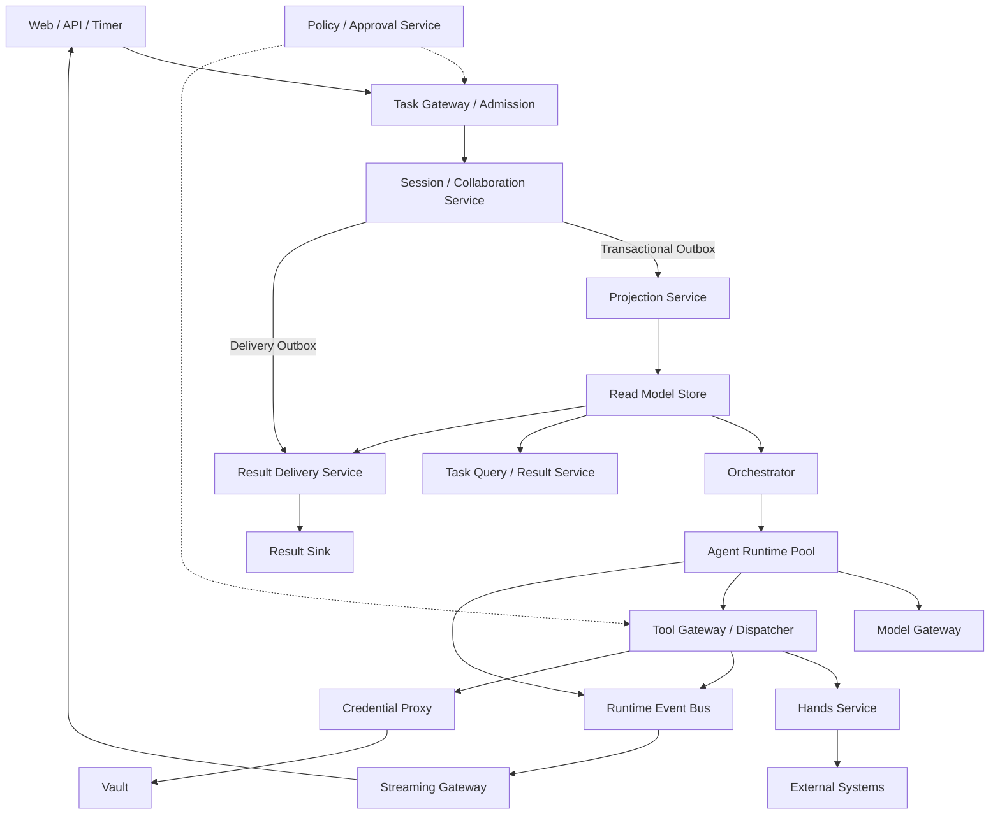

# Managed Agent 系统架构总览

本文档集将 [[Managed Agent 架构]] 的设计原则和系统架构图拆分为可落地的组件详细设计。系统把长期任务视为由持久事实、派生视图、运行时控制、Agent Runtime、工具执行和交付平面共同组成的分布式系统，而不是一个常驻 Agent 进程。

## 总体原则

- Session Canonical Event Log 是任务事实源。
- Read Model Store 是可重建的查询副本，不是事实源。
- Control State Store 保存租约、心跳和调度队列等短期运行状态。
- Coordinator 决定任务如何拆分；Orchestrator 只负责运行实例调度。
- Runtime Event Bus 保存短期实时事件，不能替代 Session Event Log。
- Streaming Gateway 只推送通知，不接收改变任务状态的命令。
- Result Delivery 必须由持久 Outbox 事件触发，不能依赖短期实时流。
- Agent 可以使用外部能力，但不能读取真实凭证。

## 核心链路



## 文档索引

### 接入与交付

- [[01 Task Gateway Admission]]
- [[05 Task Query Result Service]]
- [[07 Streaming Gateway Service]]
- [[08 Result Delivery Service]]
- [[21 External Integration Contracts]]

### 持久事实与派生状态

- [[02 Session Collaboration Service]]
- [[03 Projection Service]]
- [[04 Read Model Store]]
- [[06 Runtime Event Bus]]
- [[17 Artifact Store]]

### 控制平面与 Agent Runtime

- [[09 Orchestrator]]
- [[10 Control State Store]]
- [[11 Agent Runtime Pool]]
- [[12 Coordinator Agent Runtime]]
- [[13 Worker Reviewer Runtime]]
- [[14 Model Gateway Inference Service]]

### 行动与安全

- [[15 Tool Gateway Dispatcher]]
- [[16 Hands Service]]
- [[18 Policy Approval Service]]
- [[19 Credential Proxy Vault]]
- [[20 Observability Audit]]

### 公共契约

- [[22 Shared Event and State Contracts]]

## 事实与状态归属

| 数据 | 唯一写入方 | 存储位置 | 是否可重建 |
|---|---|---|---|
| 用户命令、模型完成输出、工具结果、审批结果、任务生命周期 | Session / Collaboration Service | Canonical Event Log | 否，事实源 |
| Control、Collaboration、Result、Approval 视图 | Projection Service | Read Model Store | 是 |
| 租约、心跳、Assignment、Runnable Queue | Orchestrator | Control State Store | 部分可恢复，短期状态 |
| Token Delta、实时进度、Typing、短期状态 | Runtime producers | Runtime Event Bus | 不保证长期存在 |
| 文件、报告、数据集、补丁和大型日志 | Artifact producers | Artifact Store | 由版本和保留策略决定 |
| Secret、OAuth Token、外部系统凭证 | Vault | Secret Store | 不进入 Session 和 Sandbox |

## 部署边界

MVP 可以合并部署，但逻辑边界不能合并：

```text
Task API Deployment
  Task Gateway
  Task Query / Result Service

Session Deployment
  Session / Collaboration Service
  Projection Workers
  Read Model Store

Runtime Control Deployment
  Orchestrator
  Control State Store

Delivery Deployment
  Streaming Gateway
  Result Delivery Workers
```

生产阶段按负载和故障域拆分。任何拆分都不得引入跨组件数据库表直写或跨边界事务。

## 架构完成标准

- 任一 Brain、Hands 或 Orchestrator 实例死亡后，任务能够从 Session 恢复。
- 相同幂等键不会创建多个 Root Session 或重复外部副作用。
- Child Session 的依赖、所有权和结果可追踪。
- Projection 可以从 Canonical Event Log 全量重建。
- 网页断线不会取消任务，重连可以恢复可见事件。
- Result Delivery 重启后不会丢失完成通知。
- 审批与具体 action digest 绑定，不能跨动作复用。
- Sandbox 和 Agent Runtime 无法读取真实凭证。
