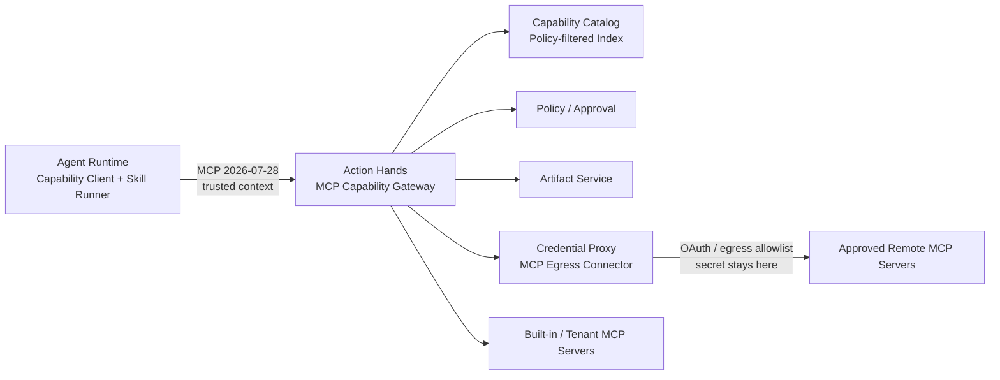

# MCP Runtime 能力平面

> 实施状态（2026-07-24）：M9 已按 Issue #21 拆分为设计、协议原语、Catalog、Resource、
> Skill Package、Skill Runner、远端 Egress 和生产对账堆叠 PR。运行与回滚说明见
> [M9 MCP Runtime 实施与运维](../../development/implementation/mcp-runtime.md)。
>
> Capability Plane 与普通任务决策循环的接入由
> [GitHub Issue #31](https://github.com/sushaofei/AuraClaw/issues/31) 跟踪。
>
> MCP Server 运行时配置、持久化 revision、重启恢复和本地/私网连接的增量设计见
> [MCP 开发手册](../../guides/mcp-development.md) 汇总热配置入口与接入步骤，实现由
> [GitHub Issue #50](https://github.com/sushaofei/AuraClaw/issues/50) 跟踪。

## 1. 目标

本文定义 AuraClaw 如何通过协议无关的 Hands Contract 为 Agent Runtime 提供数据、工具和技能。
MCP 与 Java API 只作为 Hands 下游 Connector。Issue #43 之后，Runtime 不再使用内部 `/mcp`。
实现跟踪见 [ADR-002](../decisions/ADR-002-hands-boundary-and-connectors.md) 与
[GitHub Issue #43](https://github.com/sushaofei/AuraClaw/issues/43)。

目标：

- Runtime 使用一个稳定客户端发现和使用数据、工具、技能。
- 外部 MCP Server 可以独立接入、升级、熔断和下线，不改变 Agent Runtime。
- 能力在进入模型上下文或产生副作用前经过 tenant、策略、审批、凭证和数据分类控制。
- 长任务恢复时能够重建当时实际使用的能力版本、输入、结果和证据。
- 能力目录可扩展到大量 Server，同时通过渐进式披露控制 Token 和上下文噪声。

非目标：

- MCP 不替代 Canonical Session Event、Control Lease、Hands Invocation Store 或 Artifact Store。
- Runtime 不直接连接任意第三方 MCP Server，不接收 Server URL、启动命令或明文凭证。
- 不把 MCP Runtime Event、订阅通知或 MCP Tasks Extension 当作 AuraClaw 的结果交付保证。
- 不把技能退化为单个 Tool；技能描述过程策略，Tool 执行物理动作。

### 1.1 当前基线与差距

现有代码已经具备：

- `contracts/hands.py` 中的协议无关 Hands DTO 与内部路径。
- Runtime 侧 `HandsClient` / `HttpHandsClient` 的 list/call/read/cancel。
- 下游 `infrastructure/connectors/mcp` 中的 MCP 2026-07-28 wire 与 ManagedMcpConnector。
- Action Hands 侧 Tool Registry、Schema、Policy、Approval、Invocation Store、Artifact 和 Credential 边界。
- 内部 Hands HTTP 的 workload/lease 认证与大小限制。

尚缺：

- `resources/*`、`prompts/*`、分页、订阅和 `list_changed`。
- 多 MCP Server 的受管注册、连接、健康、目录同步、名称冲突和租户隔离。
- 面向大目录的检索与渐进式披露。
- Skill Manifest、包存储、依赖解析、版本固定、激活事件和恢复游标。
- 远端 MCP OAuth/Egress、内容安全和跨能力组合策略。

## 2. 核心判断

### 2.1 MCP 原语与 AuraClaw 概念的映射

| AuraClaw 概念 | MCP 表达 | 控制方 | AuraClaw 语义 |
|---|---|---|---|
| 数据 | Resources / Resource Templates | Application / Runtime | 可读取的上下文、文件、Schema、记录或 Artifact |
| 工具 | Tools | Model | 有明确输入输出、风险和副作用的原子动作 |
| 提示模板 | Prompts | User / Host | 用户或产品显式选择的交互模板 |
| 技能 | Resources + AuraClaw Skill Manifest | Runtime | 可版本化的流程、启发式、约束和依赖绑定 |
| 远端长调用 | MCP Tasks（可选） | Requestor | 仅为远端调用句柄，不是 AuraClaw Task/Session |

MCP 规范只有 Prompts、Resources 和 Tools 三类 Server 原语，没有 Skill 原语。因此：

- 技能清单、完整说明和附件使用 MCP Resource 暴露。
- Runtime 的 Skill Resolver 负责选择版本、校验依赖并创建绑定。
- Runtime 的 Skill Runner 负责把技能步骤注入当前 Harness，并调用已绑定 Tool。
- 只有真正由远端系统独立执行的黑盒工作流才暴露成 Tool；它不因此成为 AuraClaw Skill。
- MCP Prompt 不能代替 Skill。Prompt 是交互模板，Skill 是应用控制、可治理的过程资产。

### 2.2 单一受控入口

生产 Runtime 只连接 AuraClaw 内部 Capability Gateway：



该入口复用现有 `action-hands` 部署单元，首期不增加第 13 个生产服务。内部按职责拆成：

```text
Capability Gateway
├── MCP Front Door
├── Capability Catalog / Search
├── Resource Gateway
├── Skill Registry Adapter
├── Tool Gateway（已有）
├── Policy / Approval Adapter
├── Server Connection Manager
├── Result / Content Normalizer
└── Audit / Runtime Event Publisher
```

Runtime 不信任 Server 返回的注解、描述、Schema、资源内容或 Tool Result。Gateway 在返回前统一补充
权威来源、tenant、策略、版本和分类信息。

### 2.3 Resource 与只读 Tool 的选择

“读取数据”不一定都建模成 Resource：

| 场景 | 选择 |
|---|---|
| 有稳定 URI、可重复读取的文件、文档、Schema、记录或快照 | Resource |
| 通过有限参数定位一个稳定对象 | Resource Template |
| 需要搜索、聚合、计算、分页查询或按模型参数动态执行 | read-only Tool |
| 会写入、发送、删除、启动任务或产生外部副作用 | Tool |
| 描述多步流程、决策和约束并组合多个能力 | Skill |

read-only Tool 的结果可以返回 Resource Link 或 Artifact Ref，供 Runtime 在独立授权后加载。这样既保留
模型主动查询能力，也避免把任意查询伪装成可订阅的稳定资源。

## 3. 能力模型

### 3.1 统一描述符

Catalog 使用统一描述符做检索，但保留各 MCP 原语的原生契约：

```json
{
  "capability_id": "cap_01...",
  "kind": "resource | resource_template | tool | prompt | skill",
  "server_id": "srv_github",
  "canonical_name": "github.issue.create",
  "version": "2.3.1",
  "content_digest": "sha256:...",
  "title": "Create issue",
  "description": "...",
  "tags": ["github", "issue"],
  "tenant_scope": "tenant-a",
  "trust_level": "platform | tenant_verified | external_untrusted",
  "classification": "internal",
  "permission": "write-with-approval",
  "risk_level": "high",
  "required_scopes": ["issues:write"],
  "status": "active | degraded | quarantined | retired",
  "source_revision": "etag-or-server-revision",
  "updated_at": "2026-07-24T00:00:00Z"
}
```

`canonical_name` 在 AuraClaw Catalog 内唯一，推荐使用
`<publisher>.<domain>.<capability>`。原始 MCP Tool 名仍保留，并在路由时转换。

### 3.2 Resource

Resource 是读取数据的标准入口：

- 使用 `resources/list`、`resources/templates/list` 和 `resources/read`。
- URI 必须使用已注册 Scheme 和 Server Namespace，不能由 Runtime 提交任意 HTTP URL。
- 每次读取都附加 `source_revision`、`content_digest`、`classification`、`retrieved_at` 和来源。
- 大内容、二进制内容和需要长期引用的内容写入 Artifact，返回 `artifact_ref`。
- `resources/subscribe` 和 `notifications/resources/updated` 只用于缓存失效，不作为持久事实。
- Tool Result 中的 `resource_link` 只视为引用；未经再次授权不得自动读取。

Resource 内容是外部不可信数据。进入模型上下文前必须执行：

```text
URI/tenant ACL
 -> Policy/Data Egress Check
 -> 大小与 MIME 限制
 -> Malware/DLP/Secret Scan
 -> Prompt Injection 标记
 -> 内容截断或 Artifact 化
 -> Context Policy 决定是否注入
```

### 3.3 Tool

Tool 延用现有 `ToolCapability`、`ToolInvocation` 和 `ToolResult`，并补齐 MCP 2026-07-28 语义：

- Schema 默认按 JSON Schema 2020-12 校验。
- `inputSchema` 在 Gateway 校验；存在 `outputSchema` 时 Server 和 Gateway 均校验结构化结果。
- Server 返回的 Tool annotations 只是提示，风险、只读性和副作用以 AuraClaw Policy 为准。
- 参数校验失败作为 Tool Execution Error 返回，使模型有机会修正；协议结构错误才使用 JSON-RPC Error。
- 业务幂等继续使用 `tool_invocation_id` 和 `idempotency_key`，不能使用 JSON-RPC request id。
- 大结果写 Artifact；外部写操作保存 resource id、version/ETag 和 side-effect status。

### 3.4 Skill

Skill 是不可变、可签名、可版本化的技能包：

```text
skill package
├── manifest.json             必需，机器可读
├── SKILL.md                  必需，完整执行说明
├── references/*              可选，按需加载
├── assets/*                  可选，模板与静态资源
└── tests/*                   可选，准入与健康探针
```

Manifest 最小字段：

```json
{
  "name": "release.prepare",
  "version": "1.4.0",
  "description": "准备一次可审计发布",
  "applies_when": ["repository release requested"],
  "not_when": ["production rollback"],
  "input_schema": {"type": "object"},
  "output_schema": {"type": "object"},
  "required_tools": [
    {"name": "github.pull_request.get", "version": ">=2,<3"}
  ],
  "required_resources": [
    {"uri_template": "repo://{repo}/release-policy"}
  ],
  "allowed_roles": ["coordinator", "worker"],
  "data_classification": "internal",
  "risk_level": "medium",
  "max_steps": 20,
  "timeout_seconds": 900,
  "publisher": "platform",
  "signature": "..."
}
```

MCP Resource URI 约定：

```text
skill://<publisher>/<name>/<version>/manifest
skill://<publisher>/<name>/<version>/SKILL.md
skill://<publisher>/<name>/<version>/references/<path>
skill://<publisher>/<name>/<version>/assets/<path>
```

渐进式披露分三层：

1. 发现：名称、描述、适用条件、风险和版本，进入候选上下文。
2. 解析：Manifest、依赖和约束，由 Skill Resolver 加载。
3. 执行：只加载当前步骤需要的 `SKILL.md` 章节、reference 或 asset。

技能激活不是远端副作用调用。Runtime 生成稳定绑定：

```json
{
  "skill_activation_id": "ska_01...",
  "skill_name": "release.prepare",
  "skill_version": "1.4.0",
  "package_digest": "sha256:...",
  "resolved_tools": [
    {"capability_id": "cap_...", "version": "2.3.1", "schema_digest": "sha256:..."}
  ],
  "resolved_resources": [
    {"server_id": "srv_repo", "uri_template": "repo://{repo}/release-policy"}
  ],
  "policy_version": "policy-42",
  "activated_for": {"tenant_id": "t1", "session_id": "s1", "run_id": "r1"}
}
```

一个 Run 内绑定固定。Catalog 的 `list_changed` 通知不能悄悄替换已激活版本；升级只影响下一次解析，
除非当前绑定已被撤销且 Policy 要求立即停止。

### 3.5 Skill 控制面生命周期

Skill 的创作、包发布、租户安装和运行时激活是四个不同阶段，不能由 Runtime 扫描目录或在任务期
临时发布：

```text
本地 CLI / Admin Upload / Built-in / Model Compiler / MCP Source
 -> 统一 PublishSkillPackage 准入命令
 -> 不可变 SkillPackage + Artifact
 -> Publisher SkillPublication
 -> tenant SkillInstallation
 -> Capability Catalog 可重建投影
 -> Runtime search/load/resolve/activate
```

权威状态分为：

- `SkillPackage`：不可变内容、Manifest、digest、签名 key id 和 Artifact Ref；
- `SkillPublication`：Publisher 的 `staged/validating/active/quarantined/revoked` 发布状态；
- `SkillInstallation`：tenant 的 `active/disabled/uninstalled` 期望状态、版本约束和来源抑制；
- `SkillSource/SyncState`：外部来源配置、cursor、完整快照 generation 和失败状态；
- `CapabilityDescriptor`：只做可搜索投影，丢失后从上述状态重建。

`purged` 不是 Publication 状态。物理包清理由 Artifact 保留策略和 Package tombstone 表示；历史
publisher/name/version/digest 必须继续可解释。普通停用只影响新的发现和激活，不等同安全撤销。
安全撤销是否继续、暂停或取消已有 binding 由明确 Policy 决定，不能由包读取代码根据 Publication
非 active 状态隐式决定。

发布准入可以读取完整包以验证所有文件 digest 和签名；Runtime 的渐进加载仅表示按当前步骤注入
`SKILL.md`、reference 或 asset。包内 `tests/` 首期只允许平台定义的声明式测试向量，禁止执行任意
Python、Shell、二进制或其他代码。

所有添加入口收敛到同一应用命令，并携带 tenant、command id、expected version、actor、correlation
和 causation context。生产跨信任域使用 Publisher Registry 与非对称签名；现有 HMAC 只作为平台
兼容和开发测试适配器。

首个迁移入口由 `SkillPublicationService` 承担。它在写 Artifact 前校验受信 Source 的启用状态和
publisher allowlist，调用既有确定性包校验与签名验证，只允许新包进入 `staged` 或 `active`，随后写
不可变 Package、带 revision 的 Publication，并在激活时创建 tenant Installation。相同 identity 和
digest 是幂等成功，相同 identity 不同 digest 必须冲突；`staged -> active` 必须携带当前 revision。

`POST /v1/admin/skill-publications` 保留小包兼容入口：正文使用受限数量和总大小的 base64 文件映射。
较大包和 CLI 使用两阶段 Artifact 协议：先通过 `POST /v1/admin/skill-package-uploads` 获取单段或分段
预签名 URL，直传对象存储并 finalize，再用 `artifact_ref + expected_digest` 调用同一个 Publication
入口。两条路径最终都进入 `SkillPublicationService` 的 Source、allowlist、Archive、Manifest、声明式
测试向量、digest 与签名准入；staged 路径复用既有 Artifact Ref，不产生第二份对象。tenant/actor 只取
服务端 Identity，所有控制面写入均携带可信请求头中的 command/correlation context。

Task API 到 Artifact Service 的 workload 权限只允许 `internal` 分类、24 MiB 以内、具有 retention 且
作用域为 `skill-upload:*` 的 Skill media type；finalize 重新验证相同约束。Task API 不持有对象存储
凭证，调用方也不能借该身份创建或完成通用 Artifact。SQL 部署使用持久 Lifecycle Store；内存 Store
只用于开发测试。

生产部署中，Task API 只负责验证外部 Identity 和构造发布命令，不持有对象存储凭证，也不在自身
进程内落 Skill Artifact。它通过带 workload identity 的内部契约调用 Action Hands：

```text
CLI/Admin -> Task API -> Artifact Service create/finalize -> immutable Artifact Ref
          -> Task API RemoteSkillPublicationClient
          -> Action Hands SkillPublicationInternalService
          -> SkillPublicationService admission
          -> persistent Lifecycle Store + existing Artifact Ref
```

内部服务重新校验调用方身份、command/request id、base64 与包大小，包路径/Manifest/签名验证必须先于
版本冲突判断，避免恶意包通过既有版本探测绕过准入错误。开发 memory profile 可以使用进程内适配器；
SQL profile 必须走 Action Hands。该链路解决 Artifact 所有权，不代表统一 Catalog 已完成：在持久包恢复、
Installation 投影与 Resolver 回查就绪前，不能提前删除 Runtime 的兼容目录。
Task API 在迁移期可把已确认的发布结果写入本副本只读兼容缓存，以保证同请求副本的旧查询入口立即可见；
该缓存不是事实源，也不提供跨副本一致性，后续必须由持久查询/统一 Catalog 取代。

开发者 CLI 提供 `auraclaw skills validate|test|publish`。`validate` 使用与服务端相同的包解析、路径、
Manifest、digest 和签名规则；`test` 只验证 `tests/*.json` 声明式向量，绝不加载或执行包内 Python、
Shell 或二进制；`publish` 仅从指定环境变量读取 bearer token，并始终使用 staged Artifact 路径。
当前 CLI 只支持平台 HMAC 兼容发布，外部 publisher 必须等 Publisher Registry、Ed25519/key rotation
落地后接入，不能把开发密钥当生产信任根。

两阶段传输已完成，但 finalized 后、Publication 提交前失败会留下 ready Artifact。当前使用保守的
90 天 retention，不能由 pending-upload GC 误删；持久命令审计/Outbox、可证明未被 Package 引用的
ready-orphan GC 及并发幂等记录属于后续独立阶段。Source 多副本租约/对账与 Publisher Registry 也仍未
完成，不能将本阶段描述为完整供应链治理。

Action Hands 启动及周期对账时由 `SkillStateRebuilder` 枚举 Lifecycle tenant，从受 Policy 保护的
Artifact 下载接口读取不可变包，并再次校验大小、内容 hash、Archive、Manifest、package digest 和
Publisher 签名。恢复结果同时装入本地执行 Registry，并以 tenant 专属虚拟 Server 投影到持久
Capability Catalog。`capabilities.search/load` 只查询 Catalog，不再拼接进程内 Skill 目录；Resolver
只从重建后的 Registry 选择候选，因此 Catalog 与 Resolver 共享同一组 Publication/Installation 事实。

恢复时必须区分“可发现性”和“已绑定内容可读性”：只有 `active Publication + active Installation +
版本约束/固定 digest 匹配` 才进入 Catalog 和 Resolver 候选；普通 disable/uninstall 只移除新发现和
新绑定。仍处于 active Publication 且 Package retained 的内容继续按已固定 digest 可读，使既有 binding
不会因普通停用而隐式失效。安全 revoke、Package purge 和已有 binding 的停止策略仍由后续显式治理
动作完成。

MCP `skill://` 发现也不能直接写进程 Registry。Reconciler 从 Server 配置读取 fail-closed 的
`skill_publisher_allowlist`，建立持久 MCP Source，并调用同一 `SkillPublicationService`；缺少 allowlist
时整个来源拒绝发布。发布完成后触发 tenant 重建，周期重建负责修复短暂 Artifact/Catalog 故障。

管理动作必须区分租户意图和全局安全状态：

- `disable`：Installation `active -> disabled`，停止新发现/新绑定；
- `enable`：Installation `disabled -> active`；
- `uninstall`：Installation `active|disabled -> uninstalled`，表示租户逻辑删除；
- `install`：仅允许 `uninstalled -> active`，避免 enable 隐式重装；
- `revoke`：Publication 任一非 revoked 状态进入 `revoked`，用于安全事件并立即使固定包不可加载。

这些命令携带 tenant、actor、command/correlation/causation、expected revision；disable、uninstall 和
revoke 还必须带非空 reason code。Task API 只负责外部 Identity 与 HTTP 映射，SQL profile 经 workload
identity 调用 Action Hands，后者原子更新 Lifecycle 后触发 tenant rebuild。Publication 保存
`updated_by`，由 migration 回填历史记录的 `created_by`。重复到达且目标状态已满足时返回当前记录并再次
投影，以修复“事实已提交、投影响应失败”的重试场景。

Admin 同时提供持久 Installation 和指定 Publication 的状态查询，返回 revision、reason、updated actor
和时间；调用方先读 revision 再提交 `X-Expected-Revision`，不能依赖本地 Registry 缓存猜测并发版本。

`uninstall` 是面向租户的删除能力，不删除不可变 Package/Artifact，也不改变 Publication；因此可审计、
可重装且不破坏已有 binding。物理 `purge` 是版本级、不可逆的独立命令，只允许已 revoke、已 uninstall、
超过 revoke 静默窗口且 retention 已到期的 Package 执行。Package legal hold 和 Artifact metadata legal hold
任一存在都拒绝删除；调用方还必须提供 reason、expected retention revision 和可信 actor。

Purge 不读取可滞后的 Projection 来判断引用。Action Hands 通过内部 Session 契约在 Canonical Event Store
执行 tenant 级 `EXISTS` 查询，并兼容 `skill.activated` 的顶层 digest 与旧
`activation.binding.package_digest` 载荷；发现任一历史
binding 即永久拒绝物理清理，以保留历史执行的可解释性。Publication revoke 后的静默窗口用于排空已经开始
但尚未写入激活事件的请求，新 binding 又会因 revoke 无法加载。

通过引用门禁后，Action Hands 先用 Policy decision 调用 Artifact Service 的受控 delete；Artifact Service
再次校验自身 retention/legal hold，并用可过期 delete lease 抢占对象删除。对象存储的 DELETE/404 都视为
幂等成功；metadata tombstone 丢失响应时可在 lease 到期后接管，已 deleted 的重试直接成功。只有物理对象和
Artifact metadata 都完成删除后，Lifecycle 才以 optimistic revision 把 Package 标为 `purged` 并记录
actor/time。若此后 Package tombstone 写入发生冲突，重试会利用 Artifact delete 幂等性收敛，不能只改
retention 状态来伪装物理删除。

## 4. 发现、加载与调用

### 4.1 协议发现和目录同步

```text
Gateway 注册受信 Server 配置
 -> 逐请求声明 2026-07-28 profile，并调用 server/discover
 -> 发现 resources / tools / prompts 能力（不声明 Tasks Extension）
 -> 分页拉取列表
 -> 规范化、校验、签名/信任分类
 -> Policy 生成可见范围
 -> 写 Capability Catalog
 -> 发布可丢弃的 list_changed / cache invalidation
```

Server 注册属于管理面写操作，只允许平台或 tenant 管理员通过版本化 Admin API 完成。配置以不可变
revision 持久化，验证成功后由 Action Hands 与 Credential Proxy 热加载；进程重启从 Registry 恢复。
Runtime 无权动态注册 URL、stdio command 或环境变量。

### 4.2 任务期发现

标准 MCP list 操作用于可见能力枚举。为避免向模型注入全量目录，Gateway 额外提供一个普通的只读
MCP Tool：

```text
auraclaw.capabilities.search
```

输入包含 `query`、`kinds`、`required_permissions`、`task_hints` 和 `limit`；tenant、Role、Run、Policy
上下文由传输层权威注入，模型不能覆盖。输出只返回候选摘要和稳定 `capability_id`，不返回完整技能正文。

检索排序综合：

- 结构化过滤：tenant、Role、状态、权限、数据分类、环境和版本兼容。
- 语义相关：任务目标与能力描述的相似度。
- 可执行性：依赖是否可满足、Server 健康、预算和超时。
- 风险：高风险能力降权，但不得用排序代替 Policy 拒绝。
- 历史质量：成功率、近期回归、废弃和漂移状态。

### 4.3 数据加载流程

```text
Runtime resources/read
 -> Gateway 解析 capability_id / URI
 -> Lease 与 tenant 校验
 -> Policy + Resource ACL
 -> 路由到固定 Server
 -> 内容扫描、分类、截断/Artifact 化
 -> 返回带 digest/version 的 Resource
 -> Runtime Context Policy 决定注入范围
 -> 需要成为任务证据时追加 Canonical Event
```

“成功读取”本身不等于 Session 事实。只有 Runtime 通过 Session Internal API 追加
`context.resource.used` 或后续模型/工具结果事件后，才成为可恢复的业务证据。

### 4.4 Tool 调用流程

```text
Runtime tools/call
 -> Gateway 从传输层构造 Trusted Context
 -> Lease/Fencing + Catalog Binding 校验
 -> 输入 Schema + Policy + Approval
 -> Hands Invocation Store begin（幂等选主）
 -> 本地执行或经 Credential Proxy 调用远端 MCP
 -> 输出 Schema + 脱敏 + Artifact 化
 -> Hands Invocation Store complete
 -> 同步关联响应返回 Runtime
 -> Runtime 追加 Canonical Tool Event
```

断连后的恢复以 Hands Invocation Store 为准。Runtime 可以查询原 invocation 状态，但不能盲目生成新的
幂等键重放未知副作用。

### 4.5 Skill 激活与执行流程

```text
Runtime 搜索 Skill 摘要
 -> Skill Resolver 读取并验证 Manifest
 -> Policy 检查 Skill、依赖组合和数据流
 -> 解析并固定 Tool/Resource 版本
 -> 追加 skill.activated Canonical Event
 -> Skill Runner 按需读取说明/附件
 -> Harness 执行步骤并调用已绑定 Tool
 -> Checkpoint 保存 activation_id + step cursor
 -> 追加 skill.completed | skill.failed | skill.cancelled
```

Skill Runner 不创建独立事实源。步骤进度可以发 Runtime Event；需要恢复的步骤游标进入 Checkpoint，
技能激活、终态、重要决策和结果进入 Canonical Event。

### 4.6 Capability-Aware Agent Loop

普通任务不预加载全量目录。Runtime 每轮只向模型暴露四个稳定控制能力和已经显式加载的业务
Tool：

```text
auraclaw.capabilities.search
auraclaw.capabilities.load
auraclaw.skills.activate
auraclaw.resources.read
```

`search` 和 `load` 通过 Action Hands 执行。后两者是 Runtime control tools：模型只能提出请求，
Runtime 使用可信 Assignment、固定 binding 和 Capability Client 完成激活或读取，不能由模型提供
tenant、Role、Policy、Credential、Server URL 或任意 URI。

任务循环为：

```text
Model turn
 -> 无 capability request：写最终 model.output.completed
 -> search：返回 bounded summary
 -> load：按 capability_id 返回权威 Tool Schema / Skill / Resource 契约
 -> Tool：Schema 进入下一轮 ModelRequest.tools 后才允许调用
 -> Skill：Resolver 固定依赖，Runtime 写 skill.activated 后注入签名说明
 -> Resource：只读取已加载 URI/template，经 Context Policy 后进入下一轮
 -> Tool/control result 写入 Transcript
 -> next Model turn
```

中间轮次使用内部 `model.turn.completed` Canonical Event，包含可恢复的 assistant Tool Call；
`tool.call.completed` 按 `tool_invocation_id` 配对为下一轮 Tool Message。只有没有待执行调用的终止
轮次写用户可见的 `model.output.completed`，中间 delta 不向用户流式发布。

Run Checkpoint 保存 `turn_index`、phase、累计预算、候选/已加载 binding、活动 Skill、
pending call index 和 Runtime Event sequence。Model、Tool 或控制调用完成后先保存 Checkpoint，
再写对应 Canonical Event；恢复时复用原 `model_call_id`、`tool_invocation_id` 和
`idempotency_key`。相同调用连续重复超过上限、搜索/加载预算或 Run step/token/cost/deadline
预算耗尽时停止。

Resource 内容始终是不可信数据。即使 Gateway 已完成 ACL、Policy、DLP 和扫描，Runtime Context
Policy 仍会截断大文本，并对带 `prompt_injection` finding 的正文执行 withheld；证据事件只保存
capability id、URI、digest、revision、classification、Policy decision 和 Artifact Ref。

## 5. 契约和状态归属

### 5.1 Runtime Capability Client

建议把当前 `ToolClient` 扩展为：

```python
class CapabilityClient(Protocol):
    async def search(...)
    async def list_resources(...)
    async def read_resource(...)
    async def list_tools(...)
    async def call_tool(...)
    async def list_prompts(...)
    async def get_prompt(...)
    async def load_skill_manifest(...)
    async def load_skill_part(...)
```

协议传输 DTO 归 `infrastructure/connectors/mcp/wire.py`；Runtime 使用的稳定 Port 和 Hands DTO 归 `contracts/hands.py` 与 `runtime/ports.py`；
Capability Catalog、Resource、Skill 和 Tool 执行实现在 `action`，具体 MCP/HTTP/Artifact 适配器在
`infrastructure`，对象图仍只由 `composition` 选择。

### 5.2 唯一写入方

| 状态 | 唯一写入方 | 存储 | 恢复语义 |
|---|---|---|---|
| Server 注册、Capability Catalog、Skill 发布状态 | Action Hands | Hands/Capability Store | 不可只靠远端列表恢复治理信息 |
| Tool Invocation、Attempt、副作用终态 | Action Hands | Hands Invocation Store | 幂等与断连恢复依据 |
| Skill 包和大型 Resource 快照 | Artifact Service | Artifact Metadata + S3 | 不可变版本 |
| Skill 激活、重要 Resource 使用、Tool 结果、任务终态 | Session | Canonical Event Log | 业务事实源 |
| Skill step cursor、MCP task id、连接 cursor | Orchestrator / Runtime owner | Checkpoint / Control Store | 可丢弃控制状态，可从事实与远端查询恢复 |
| Capability 搜索索引和 Resource 内容缓存 | Action Hands | Disposable Cache | 可重建 |
| 外部 OAuth Token、Secret、刷新状态 | Credential Proxy / Vault | Vault / Credential Store | 不进入 Runtime、Hands 业务载荷 |

### 5.3 Canonical Events

建议新增：

```text
skill.activated
skill.completed
skill.failed
skill.cancelled
context.resource.used
```

Event 只保存稳定标识、版本、digest、策略证据和 `artifact_ref`，不内联完整技能正文、外部大数据或 Secret。
`capabilities.search`、list、cache hit 和订阅更新不写 Canonical Event。

## 6. 连接、鉴权和安全

### 6.1 两段身份

```text
Runtime -> Internal Capability Gateway
```

- 使用 workload identity，绑定 `tenant_id`、`runtime_id`、`run_id`、Lease Assertion 和 Fencing Token。
- `_meta.auraclaw` 仅承载关联信息，权威身份由认证传输层生成；模型参数不能覆盖。

```text
Capability Gateway -> External MCP Server
```

- Server 必须预注册，目标、Origin、DNS/IP 范围、传输类型和 Scope 有 allowlist。
- 远端 HTTP MCP 遵循 MCP OAuth 资源服务器发现与 Resource Indicator；禁止 token passthrough。
- OAuth Token 由 Credential Proxy 的 MCP Egress Connector 持有，Action Hands 和 Runtime 不读取明文。
- 本地 stdio Server 只允许平台签名镜像/命令模板，在独立 Sandbox 中运行，不接受 Runtime 提交命令。

### 6.2 组合风险

单个能力安全不代表组合安全。Policy 在 Skill 激活和每次 Tool 调用两个层次检查：

- 不可信外部 Resource -> 高权限写 Tool 的数据流。
- 跨 tenant、跨账户、跨数据分类的 Resource/Tool 组合。
- 读取 Secret/PII 后外发、发布或消息发送。
- 两个互斥 Skill/Tool 在同一 Run 激活。
- Skill 请求的权限大于用户命令、Role Profile 或 Server 授权范围。

来自 Resource、Skill 文本、Tool 描述和 Tool Result 的“要求忽略系统规则”等内容全部是数据，不提升为
系统指令。Skill 只有通过签名、发布准入和 Policy 后才能进入受信指令层。

### 6.3 其他强制控制

- Streamable HTTP 校验 Origin；本地端点只绑定受控网络。
- JSON Schema 2020-12、URI、MIME、分页游标、内容大小和递归深度均设上限。
- Server 名称、Tool 名称、URI 与错误消息在进入日志和 Prompt 前规范化、脱敏。
- Server `list_changed` 触发增量重建和隔离检查，不能直接覆盖活动绑定。
- Server 下线时新解析 fail closed；已运行只允许按固定绑定完成安全的只读步骤，写操作重新评估。
- Capability 撤销可以使活动调用失败，但不能删除已经发生的 Canonical Event 和 Invocation 证据。

## 7. 失败与恢复

| 场景 | 处理 |
|---|---|
| Catalog 不可用 | 已固定且未撤销的绑定可短时使用；新发现 fail closed |
| Server 列表超时 | 使用有 TTL 的目录快照并标记 stale，不升级版本 |
| Resource 在读取后变化 | 以 digest/revision 标识已用版本；需强一致时读取 Artifact 快照 |
| Tool 响应丢失 | 查询 Hands Invocation Store；副作用未知则返回 `unknown` |
| Runtime 在 Skill 中途死亡 | 从 Canonical Event + Checkpoint 的 activation/step cursor 恢复 |
| Skill 依赖消失 | 不自动换版本；暂停并重新解析或请求人工处理 |
| 外部 MCP Task 未完成 | task id 绑定 invocation/auth context 后保存在控制状态，轮询终态 |
| MCP Task 状态丢失 | 以 Invocation Store 记录 `unknown`，不把 MCP Task 当作 AuraClaw 事实源 |
| Server 推送通知丢失 | 周期性全量/增量对账；通知只优化缓存时效 |

MCP Tasks 在 2026-07-28 中已移到 `io.modelcontextprotocol/tasks` Extension。首期不启用；
后续只用于支持长 Tool 调用的远端轮询，
不得与 AuraClaw Task、Run、Session 或 Delivery 状态机合并。

## 8. 可观测性

指标：

```text
mcp_server_connection_state
mcp_server_discover_latency
capability_catalog_sync_latency / sync_failure
capability_search_latency / candidate_count
resource_read_latency / bytes / cache_hit
resource_scan_denied / prompt_injection_flagged
skill_resolve_latency / activation / dependency_conflict
tool_call_latency / denied / approval_required / side_effect_unknown
mcp_protocol_error / schema_validation_failure
mcp_task_age / task_poll_failure
capability_binding_stale / revoked_inflight
```

Trace 至少关联：

```text
tenant_id, root_session_id, session_id, run_id, runtime_id,
lease_id, capability_id, server_id, skill_activation_id,
tool_invocation_id, policy_decision_id, correlation_id
```

日志不保存完整 Prompt、Resource 内容、Skill 正文、Tool 参数/结果或 Token；保存摘要、digest 和受控
Artifact 引用。

## 9. 分阶段落地

### Phase 1：统一目录与 Resource

- 实现协议发现及 list 分页。
- 建立 Capability Catalog、Server Registry 和 `auraclaw.capabilities.search`。
- 实现 Resource list/read、Artifact 化、分类、ACL 和缓存失效。
- 保持现有 Tool 调用行为兼容。

### Phase 2：Skill

- 定义 Skill Manifest Schema、签名、发布准入和 Artifact 包。
- 实现 Skill Resolver、版本固定、依赖解析、渐进式加载和 Canonical Events。
- 在 Harness Checkpoint 中加入 `skill_activation_id` 和 step cursor。

### Phase 3：远端 MCP Server

- 实现受管 Server 注册、健康检查、熔断、隔离和 Catalog 同步。
- Credential Proxy 增加 OAuth/OIDC 发现、Resource Indicator 和 MCP Egress Connector。
- 覆盖 token passthrough、SSRF、DNS rebinding、跨 tenant 和提示注入测试。

### Phase 4：通知与长调用

- 增加 Resource/Tool/Prompt list change 与 Resource subscribe 的缓存失效。
- 在确有需求时灰度启用 MCP Tasks；保留 Hands Invocation Store 和 Session 事实边界。

## 10. 验收条件

- Runtime 只配置一个内部 MCP 地址，不能注册或直连第三方 Server。
- 数据、工具和技能能按 tenant、Role、权限、风险和版本发现。
- Resource 大内容不会塞入 Session Event 或无限注入模型上下文。
- Skill 能固定版本和依赖，从 Runtime 崩溃点恢复且不静默漂移。
- Tool 调用保持现有审批、幂等、Fencing、Artifact 和副作用未知语义。
- 外部 MCP Secret、OAuth Token 不进入 Runtime、Hands 业务载荷、Prompt、日志和 Artifact。
- Catalog、订阅或 Runtime Event 丢失不会造成任务事实或最终结果丢失。
- 恶意 Resource/Skill/Tool 描述不能提升权限或绕过 Policy。
- 每次 Resource 使用、Skill 激活和 Tool 副作用都能追溯到 tenant、Session、Run、策略和来源版本。

## 11. 规范依据

- [MCP Server primitives overview](https://modelcontextprotocol.io/specification/2026-07-28/server/index)
- [MCP Resources](https://modelcontextprotocol.io/specification/2026-07-28/server/resources)
- [MCP Tools](https://modelcontextprotocol.io/specification/2026-07-28/server/tools)
- [MCP Server discovery](https://modelcontextprotocol.io/specification/2026-07-28/server/discover)
- [MCP Streamable HTTP transport](https://modelcontextprotocol.io/specification/2026-07-28/basic/transports)
- [MCP Authorization](https://modelcontextprotocol.io/specification/2026-07-28/basic/authorization)
- [MCP Tasks Extension](https://modelcontextprotocol.io/extensions/tasks/overview)
- [MCP Security Best Practices](https://modelcontextprotocol.io/docs/tutorials/security/security_best_practices)
