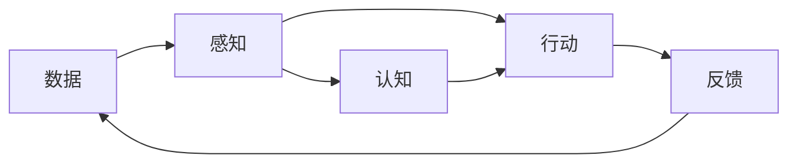

| 层次   | 代表能力        | 例子                  |
| ---- | ----------- | ------------------- |
| 感知智能 | 看见、听见、识别    | 图像识别、语音识别、人脸检测      |
| 认知智能 | 理解、推理、决策、学习 | 数学推理、法律分析、科学发现、复杂规划 |
| 行动智能 | 在现实环境中持续行动  | 机器人、自动驾驶、智能体执行任务    |
# 智能体系统框架

## 感知层
**目标**：*识别世界*
**边界**：从原始世界到结构化信息
**负责**：采集、处理、识别、融合、评估
**不负责**：理解意义、制定计划、执行动作
**能力**：数据采集、数据治理、信号处理、特征提取、感知识别、多模态融合、可靠性评估、在线反馈
### 数据采集能力
1. 明确**采集对象**
2. 定义**数据标准**
3. 搭建**采集链路**
4. 建立**质量规则**
5. 设计**采集策略**
6. 补齐**合规与安全**
7. 建立**版本管理**
### 数据治理能力
1. 建立**元数据管理**
2. 建立**数据质量检测**
3. 建立**数据清洗与去重流程**
4. 建立**数据标注与质检机制**
5. 建立**数据权限与使用管控**
6. 建立**数据血缘追踪**
7. 建立**质量监控看板**
8. 建立**错误样本回流机制**
9. 建立**数据漂移检测机制**
10. 建立**主动学习与持续迭代机制**
### 信号处理能力
1. 明确输入**信号类型**
2. 定义信号**处理标准**
3. 建立格式**转换流程**
4. 建立**去噪与增强**机制
5. 建立**时间同步**机制
6. 建立**空间校准**机制
7. 建立**采样与切片**策略
8. 建立**异常信号过滤**机制
9. 建立**特征预处理**流程
10. 建立处理**结果质检**机制
11. 建立**实时处理**链路
12. 建立处理参数**版本管理**
### 特征提取能力
1. 明确**特征目标**
2. 选择特征**表示方式**
3. 建立特征**提取模型**
4. 统一特征**输出格式**
5. 建立特征**存储与索引**
6. 建立特征**质量评估**
7. 建立特征**版本管理**
### 感知识别能力
1. 明确识别**任务类型**
2. 定义**标签体系**与**输出格式**
3. 选择**模型架构**与**基线**
4. 构建**训练与评估**流程
5. 建立**推理服务**链路
6. 建立**误识别分析**机制
7. 建立**模型迭代**机制
### 多模态融合能力
1. 明确融合**模态与场景**
2. 建立模态**对齐**机制
3. 选择**融合策略**
4. 统一**多模态表示**
5. 建立融合**结果校验**
6. 建立**缺失模态处理**机制
7. 建立融合**效果评估**
### 可靠性评估能力
1. 定义**可靠性指标**
2. 建立**置信度评估**机制
3. 建立**异常输入检测**
4. 建立**鲁棒性测试集**
5. 建立**低置信度处理策略**
6. 建立**风险分级**机制
7. 建立**人工复核**机制
### 在线反馈能力
1. 建立**线上监控指标**
2. 采集**线上预测日志**
3. 建立**错误样本回流**
4. 建立**数据漂移检测**
5. 建立**模型效果评估**
6. 建立**灰度发布**机制
7. 建立**持续迭代**闭环
---
## 认知层
**目标**：*理解环境、形成判断、制定计划与决策*
**边界**：从结构化信息到判断与计划
**负责**：理解、记忆、知识、推理、规划、决策
**不负责**：采集原始数据、直接调用工具、控制外部系统
**能力**：语义理解、意图识别、上下文记忆、知识表示、知识检索、推理分析、任务规划、决策优化、解释与归因、安全对齐、持续学习
### 语义理解能力 
1. 明确**理解对象** 
2. 定义**语义表示标准** 
3. 建立**文本/图像/语音理解模型** 
4. 建立**实体、关系与事件抽取** 
5. 建立**语境消歧机制** 
6. 建立**语义一致性校验** 
7. 建立**理解结果评估机制** 
### 意图识别能力 
1. 明确**意图类型** 
2. 定义**意图标签体系** 
3. 建立**意图识别模型** 
4. 建立**多轮意图跟踪** 
5. 建立**隐含意图识别机制** 
6. 建立**意图置信度评估** 
7. 建立**意图澄清机制** 
### 上下文记忆能力 
1. 定义**记忆范围** 
2. 区分**短期记忆**与**长期记忆** 
3. 建立**上下文压缩机制** 
4. 建立**历史状态管理** 
5. 建立**记忆检索机制** 
6. 建立**记忆更新与遗忘机制** 
7. 建立**记忆安全与权限控制** 
### 知识表示能力 
1. 明确**知识类型** 
2. 定义**知识结构** 
3. 建立**实体关系模型** 
4. 建立**知识图谱或向量表示** 
5. 建立**知识标准化机制** 
6. 建立**知识一致性校验** 7
7. 建立**知识版本管理** 
### 知识检索能力 
1. 明确**检索对象** 
2. 建立**索引结构** 
3. 选择**关键词/向量/混合检索策略** 
4. 建立**召回与排序机制** 
5. 建立**检索结果过滤机制** 
6. 建立**检索质量评估** 
7. 建立**知识更新机制** 
### 推理分析能力 
1. 明确**推理任务类型** 
2. 选择**推理方法** 
3. 建立**规则推理机制** 
4. 建立**模型推理机制** 
5. 建立**多步推理链路** 
6. 建立**推理过程校验** 
7. 建立**推理结果置信度评估** 
### 任务规划能力 
1. 明确**任务目标** 
2. 拆解**任务步骤** 
3. 识别**约束条件** 
4. 生成**执行计划** 
5. 建立**计划优先级排序** 
6. 建立**计划可行性校验** 
7. 建立**计划动态调整机制** 
### 决策优化能力 
1. 明确**决策目标** 
2. 定义**优化指标** 
3. 建立**候选方案生成机制** 
4. 建立**方案评估模型** 
5. 建立**成本收益分析** 
6. 建立**风险评估机制** 
7. 建立**决策输出机制** 
### 解释与归因能力 
1. 明确**解释对象** 
2. 定义**解释粒度** 
3. 建立**决策依据记录** 
4. 建立**推理链路追踪** 
5. 建立**结果归因分析** 
6. 建立**可解释性评估** 
7. 建立**面向用户的解释输出** 
### 安全对齐能力 
1. 定义**安全边界** 
2. 建立**价值与规则约束** 
3. 建立**风险内容识别** 
4. 建立**越权意图拦截** 
5. 建立**安全策略评估** 
6. 建立**对抗测试机制** 
7. 建立**安全审计机制** 
### 持续学习能力 
1. 建立**学习目标** 
2. 采集**反馈样本** 
3. 建立**样本筛选机制** 
4. 建立**增量更新流程** 
5. 建立**效果回归评估** 
6. 建立**灾难性遗忘防护** 
7. 建立**模型/知识迭代机制**
---
## 行动层
**目标**：*调用工具、执行动作、监控过程，并在环境中闭环完成任务*
**边界**：从计划指令到执行结果
**负责**：调用、执行、编排、控制、监控、验证、反馈
**不负责**：识别世界、解释意义、生成高层决策
**能力**：任务执行、工具调用、流程编排、系统控制、人机协同、多智能体协作、权限与安全控制、异常处理、执行监控、结果验证、反馈回流、持续优化
### 任务执行能力 
1. 明确**执行目标** 
2. 定义**执行动作** 
3. 建立**执行接口** 
4. 建立**执行参数规范** 
5. 建立**执行状态管理** 
6. 建立**执行结果记录** 
7. 建立**失败重试机制**
### 工具调用能力 
1. 明确**可用工具范围** 
2. 定义**工具调用协议** 
3. 建立**工具注册机制** 
4. 建立**参数校验机制** 
5. 建立**调用权限控制** 
6. 建立**调用结果解析** 
7. 建立**工具调用日志** 
### 流程编排能力 
1. 明确**业务流程** 
2. 拆解**流程节点** 
3. 定义**节点依赖关系** 
4. 建立**流程调度机制** 
5. 建立**条件分支机制** 
6. 建立**流程状态追踪** 
7. 建立**流程回滚机制** 
### 系统控制能力 
1. 明确**控制对象** 
2. 定义**控制指令** 
3. 建立**控制接口** 
4. 建立**状态读取机制** 
5. 建立**控制约束规则** 
6. 建立**安全保护机制** 
7. 建立**控制结果确认** 
### 人机协同能力 
1. 明确**人机分工** 
2. 定义**人工介入节点** 
3. 建立**人工确认机制** 
4. 建立**任务交接流程** 
5. 建立**人工反馈入口** 
6. 建立**协同状态同步** 
7. 建立**责任追踪机制** 
### 多智能体协作能力 
1. 明确**智能体角色** 
2. 定义**协作协议** 
3. 建立**任务分配机制** 
4. 建立**通信机制** 
5. 建立**冲突协调机制** 
6. 建立**协作结果汇总** 
7. 建立**协作效果评估** 
### 权限与安全控制能力 
1. 定义**权限模型** 
2. 建立**身份认证机制** 
3. 建立**访问控制机制** 
4. 建立**敏感操作审批** 
5. 建立**越权操作拦截** 
6. 建立**安全日志记录** 
7. 建立**操作审计机制** 
### 异常处理能力 
1. 定义**异常类型** 
2. 建立**异常检测机制** 
3. 建立**异常分级机制** 
4. 建立**自动恢复策略** 
5. 建立**人工升级机制** 
6. 建立**异常记录机制** 
7. 建立**根因分析机制** 
### 执行监控能力 
1. 建立**执行状态监控** 
2. 建立**性能指标监控** 
3. 建立**资源使用监控** 
4. 建立**错误率监控** 
5. 建立**超时与阻塞检测** 
6. 建立**告警通知机制** 
7. 建立**监控看板** 
### 结果验证能力 
1. 定义**结果验收标准** 
2. 建立**结果一致性检查** 
3. 建立**结果完整性检查** 
4. 建立**结果准确性评估** 
5. 建立**业务规则校验** 
6. 建立**人工抽检机制** 
7. 建立**验证结果记录** 
### 反馈回流能力 
1. 采集**执行日志** 
2. 采集**用户反馈** 
3. 采集**系统状态反馈** 
4. 建立**失败案例回流** 
5. 建立**高价值样本沉淀** 
6. 建立**反馈分类机制** 
7. 建立**反馈进入优化流程** 
### 持续优化能力 
1. 定义**优化目标** 
2. 建立**效果评估指标** 
3. 建立**瓶颈分析机制** 
4. 建立**策略调整机制** 
5. 建立**流程优化机制** 
6. 建立**灰度验证机制** 
7. 建立**持续改进闭环**